# Realtime Chat Application !!! 

#### Realtime Chat Application made using reactjs, expressjs, nodejs, socket.io. You can enter in any room of your choice created by you and interact with the other person in that room in real time world.

This is a web application which allows users to :-

❓ Create a chat room

❓ Sign up with multiple users in that chat room

❓ Chat with each other in realtime in that chat room

❓ Send emoji characters which will be converted to emojis

❓ View of users who are online

❓ Clear message if someone leaves the chat

# 1.Opening page of the app:

 

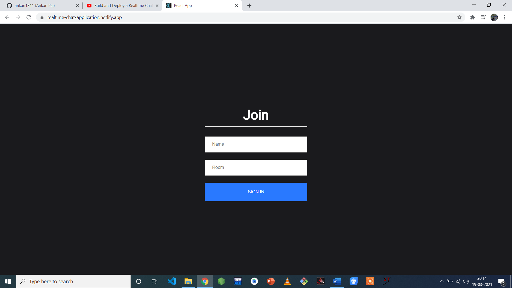
 
 

# 2.User Ankan Pal's First Screen during sign up:

 

 
 

# 3.User Mukesh Ambani's Screen during sign up:

 

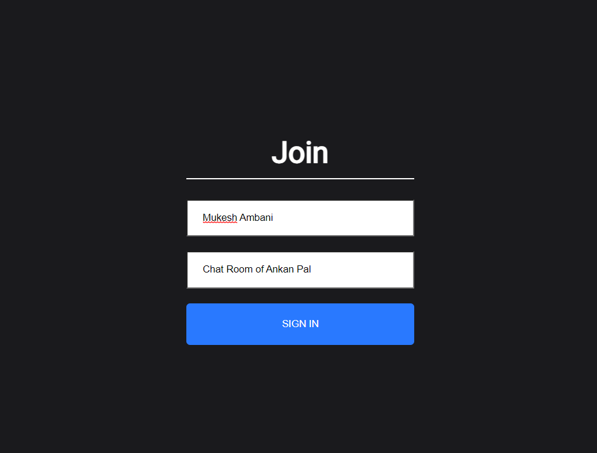
 
 

# 4.User Virat Kohli's Screen during sign up:

 

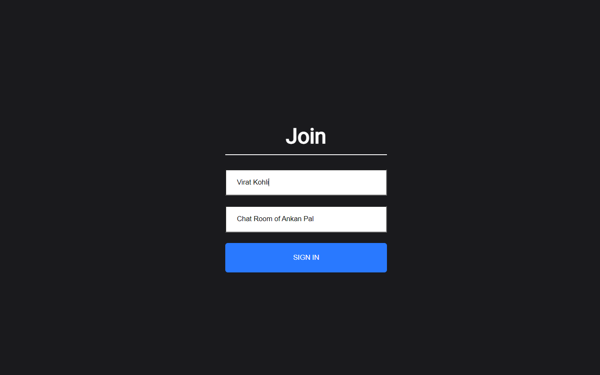

 
 

# 5.User Ankan Pal's Chat screen:

 

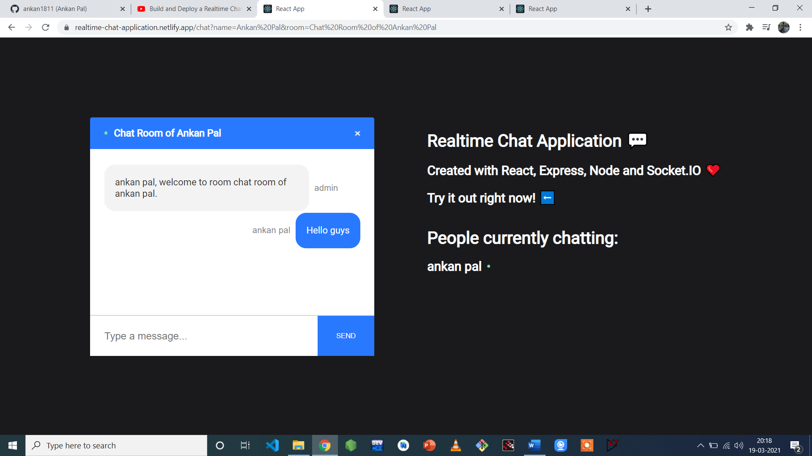

 
 

# 6.User Virat Kohli's Chat screen:

 

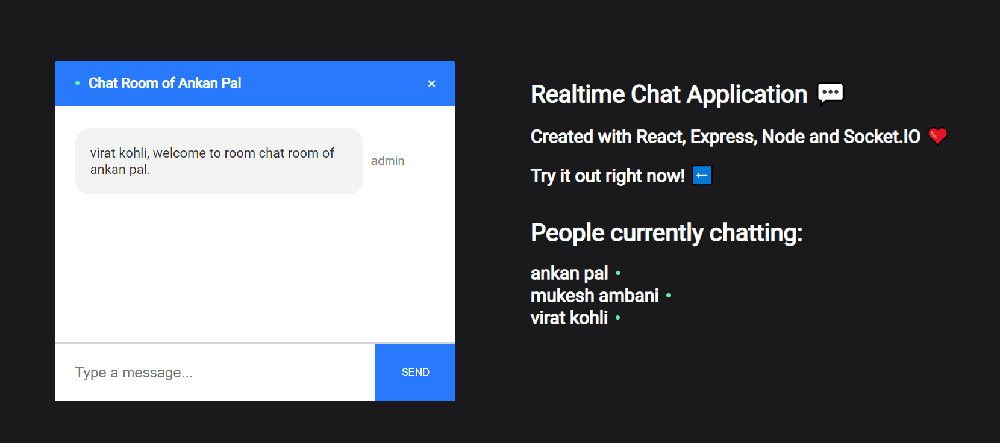

 
 

# 7.User Mukesh Ambani's Chat screen after Virat Kohli has joined:

 

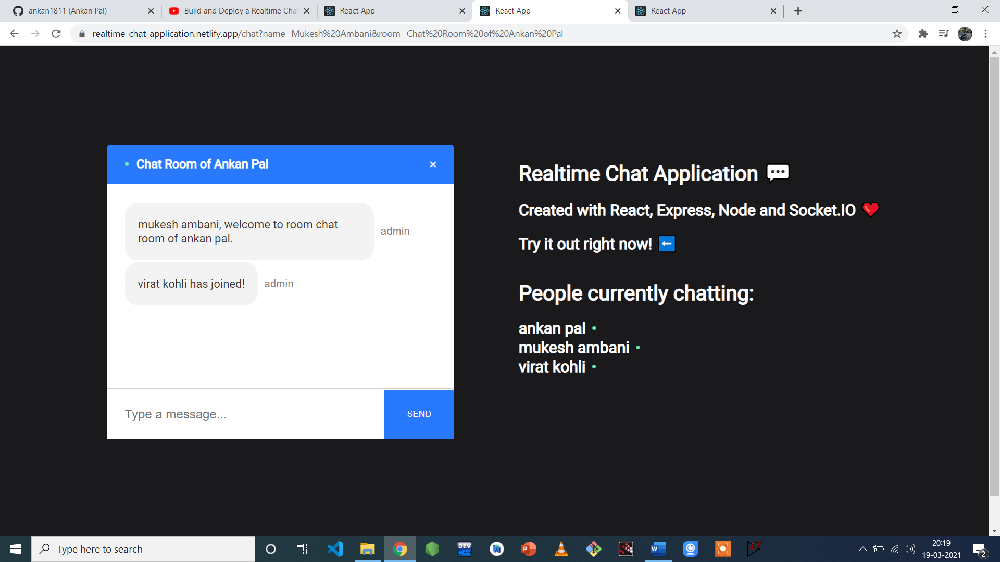

 
 

# 8.User Ankan Pal's Chat screen after Virat Kohli and Mukesh Ambani has joined:

 

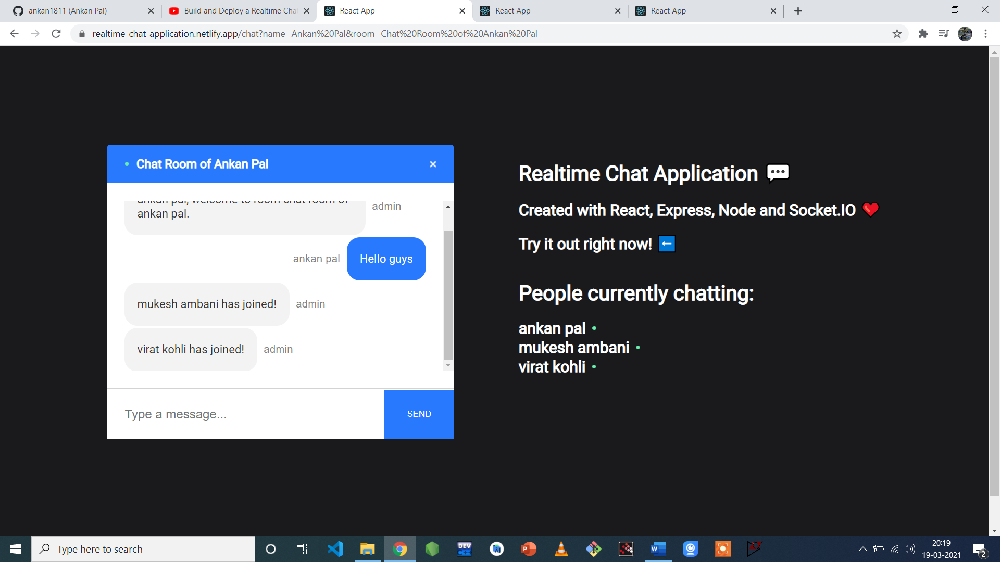

 
 

# 9.User Virat Kohli's Chat screen :

 

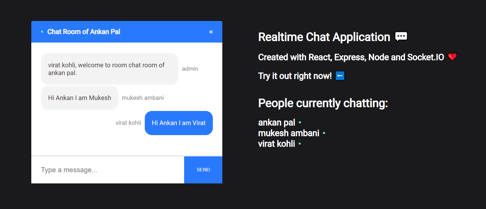

 
 

# 10.User Mukesh Ambani's Chat screen :

 

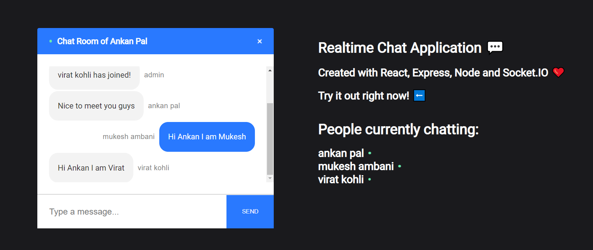

 
 

# 11.User Ankan Pal's Chat screen:

 

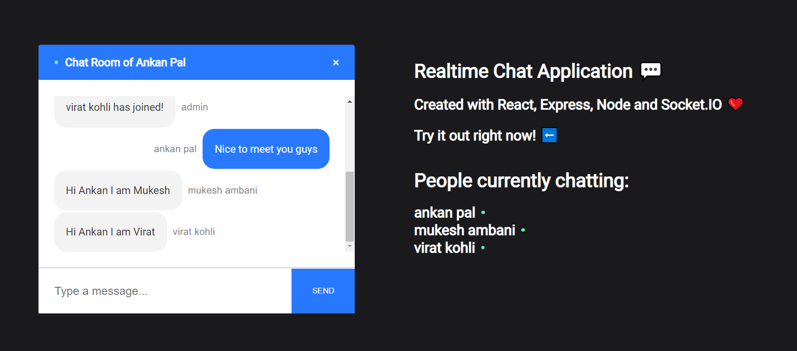

 
 

# 12. Sending an emoji in the form of charcter:

 

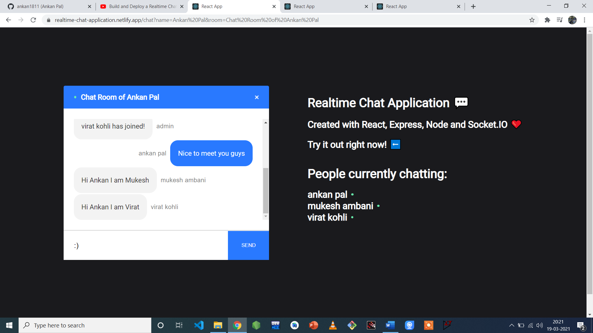

 
 

# 13.Emoji charcters get converted to real emoji:

 

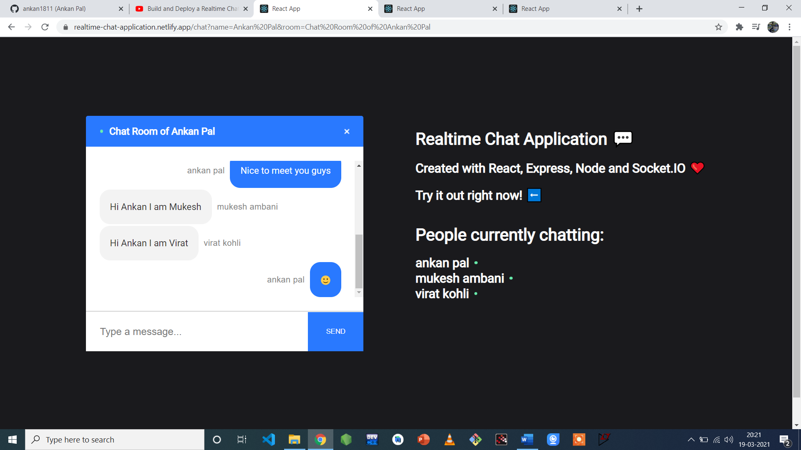

 
 

# 14.Message when a user leaves the chat room:

 

 
 
